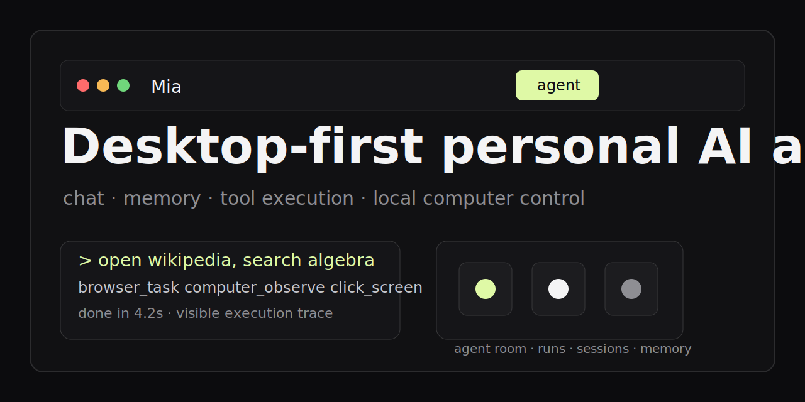

# Mia



> A desktop-first personal AI agent with chat, memory, tool execution, and local computer control.

[Website](https://mia-agent-one.vercel.app) · [Desktop Release](https://github.com/zw124/mia-agent/releases/tag/v0.1.0) · [Documentation](./docs) · [Contributing](./CONTRIBUTING.md) · [Commercial Licensing](./COMMERCIAL-LICENSE.md)

## Overview

Mia is an AI agent product, not just a chat box.

It combines:

- a Next.js web app;
- an Electron desktop app;
- a Python agent runtime;
- backend state for sessions, memories, runs, and thought logs;
- visible tool execution for browser and computer-use workflows.

The product goal is simple: a user should be able to sign in, complete onboarding, open the desktop app, and then interact with the same agent through a product interface instead of raw terminal commands.

## Table of contents

- [Why Mia](#why-mia)
- [Core capabilities](#core-capabilities)
- [Architecture](#architecture)
- [Getting started](#getting-started)
- [Environment](#environment)
- [Development](#development)
- [Releases](#releases)
- [Privacy and local profile](#privacy-and-local-profile)
- [Documentation](#documentation)
- [Contributing](#contributing)
- [Security](#security)
- [License](#license)

## Why Mia

Most AI products stop at text generation. Mia is built around execution, continuity, and visibility.

Key differences:

- desktop-first interaction instead of browser-only chat;
- session and memory continuity across runs;
- visible tool traces instead of opaque background actions;
- approval-oriented workflows for higher-trust tasks;
- support for local runtime control and computer-use scenarios.

## Core capabilities

- Desktop-first chat product with a web companion interface
- Guided onboarding and setup flow
- Session-aware chat with memory and thought logging
- Tool routing for search, browser tasks, and computer-use actions
- Agent room visualization for runtime state
- Optional integrations such as Telegram, SendBlue, and connected-app tooling
- Local runtime orchestration for dashboard, agent service, and backend state
- Desktop packaging and release flow

## Architecture

```text
apps/dashboard      Next.js web app
apps/desktop        Electron desktop app
apps/agent-service  Python agent runtime
convex              Backend state and functions
website             Product-facing web assets
scripts             Local runtime and build scripts
docs                Architecture, process, and governance docs
```

See [docs/ARCHITECTURE_OVERVIEW.md](./docs/ARCHITECTURE_OVERVIEW.md) for the longer version.

## Getting started

### For users

- Product website: [mia-agent-one.vercel.app](https://mia-agent-one.vercel.app)
- macOS desktop download: [Mia 0.1.0](https://github.com/zw124/mia-agent/releases/download/v0.1.0/Mia-0.1.0-arm64.dmg)

Current desktop release note:

- the macOS build is unsigned for testing;
- production notarization and Developer ID signing are still pending.

### For developers

#### 1. Install dependencies

```bash
npm install
python -m venv .venv
. .venv/bin/activate
pip install -e "apps/agent-service[dev]"
```

#### 2. Configure environment

Use the sample environment file as the starting point:

```bash
cp .env.example .env.local
cp user.example.md user.local.md
```

At minimum, review these values:

- `OPENAI_API_KEY`
- `OPENAI_BASE_URL`
- `MODEL_NAME`
- `NEXT_PUBLIC_CONVEX_URL`
- `AGENT_SERVICE_URL`
- `NEXT_PUBLIC_SUPABASE_URL`
- `NEXT_PUBLIC_SUPABASE_PUBLISHABLE_KEY`
- `NEXT_PUBLIC_SUPABASE_ANON_KEY`

#### 3. Start the product

Desktop product flow:

```bash
npm run desktop:dev
```

Web app only:

```bash
npm run dev:dashboard
```

Broader local gateway flow:

```bash
npm run mia:gateway:localtunnel
```

#### 4. Open the app

During local development, the main web entry point is:

```text
http://localhost:3000
```

## Environment

### Core model

```bash
OPENAI_API_KEY=
OPENAI_BASE_URL=https://api.openai.com/v1
MODEL_NAME=gpt-4o-mini
TRANSCRIPTION_MODEL=whisper-1
```

### Backend and runtime

```bash
CONVEX_URL=
CONVEX_SITE_URL=
NEXT_PUBLIC_CONVEX_URL=
AGENT_SERVICE_URL=http://localhost:8000
MIA_INTERNAL_SECRET=change-me
```

### Supabase

```bash
NEXT_PUBLIC_SUPABASE_URL=
NEXT_PUBLIC_SUPABASE_PUBLISHABLE_KEY=
NEXT_PUBLIC_SUPABASE_ANON_KEY=
```

### Web auth

```bash
MIA_WEB_ADMIN_EMAIL=owner@mia.local
MIA_WEB_ADMIN_PASSWORD=mia-local-admin
MIA_WEB_AUTH_SECRET=change-this-before-deploy
```

### Optional integrations

```bash
SENDBLUE_API_KEY_ID=
SENDBLUE_API_SECRET_KEY=
SENDBLUE_FROM_NUMBER=
SENDBLUE_WEBHOOK_SECRET=
SENDBLUE_STATUS_CALLBACK=
OWNER_PHONE_NUMBER=
TELEGRAM_BOT_TOKEN=
TELEGRAM_WEBHOOK_SECRET=
TELEGRAM_OWNER_CHAT_ID=
TELEGRAM_ALLOWED_CHAT_IDS=
```

See [DEVELOPMENT.md](./DEVELOPMENT.md) and [docs/LOCAL_SETUP.md](./docs/LOCAL_SETUP.md) for a more complete setup walkthrough.

## Development

Common commands:

```bash
npm run build
npm run typecheck
npm run lint
pytest -q
```

Desktop packaging:

```bash
npm run package:mac --workspace apps/desktop
```

Before opening a PR, review:

- [CONTRIBUTING.md](./CONTRIBUTING.md)
- [CODING_STANDARDS.md](./CODING_STANDARDS.md)
- [TESTING.md](./TESTING.md)

## Releases

The current public desktop artifact is published from GitHub Releases.

- Release page: [v0.1.0](https://github.com/zw124/mia-agent/releases/tag/v0.1.0)
- Production site: [mia-agent-one.vercel.app](https://mia-agent-one.vercel.app)

For release mechanics, see [docs/RELEASE_PROCESS.md](./docs/RELEASE_PROCESS.md).

## Privacy and local profile

Do not commit personal profile data to the repository.

- `user.example.md` is a safe template.
- `user.local.md` is the preferred local-only file for real personal preferences.
- the runtime reads `user.local.md` first and only falls back to `user.md` for older local setups.

If you create a local profile, keep it out of version control.

## Documentation

Project documentation lives in [docs](./docs).

Good starting points:

- [docs/ARCHITECTURE_OVERVIEW.md](./docs/ARCHITECTURE_OVERVIEW.md)
- [docs/API_CONTRACTS.md](./docs/API_CONTRACTS.md)
- [docs/SECURITY_MODEL.md](./docs/SECURITY_MODEL.md)
- [docs/PLUGIN_GUIDE.md](./docs/PLUGIN_GUIDE.md)
- [docs/MAINTAINER_GUIDE.md](./docs/MAINTAINER_GUIDE.md)

## Contributing

Community contributions are welcome under the project contribution policy.

Please read:

- [CONTRIBUTING.md](./CONTRIBUTING.md)
- [CLA.md](./CLA.md)
- [CODE_OF_CONDUCT.md](./CODE_OF_CONDUCT.md)
- [docs/CONTRIBUTOR_LADDER.md](./docs/CONTRIBUTOR_LADDER.md)

## Security

If you discover a vulnerability or sensitive data exposure, follow [SECURITY.md](./SECURITY.md) instead of opening a public issue first.

## License

This repository is licensed under `AGPL-3.0-only`.

- Open source terms: [LICENSE](./LICENSE)
- Commercial licensing path: [COMMERCIAL-LICENSE.md](./COMMERCIAL-LICENSE.md)
- Third-party notices: [THIRD_PARTY_NOTICES.md](./THIRD_PARTY_NOTICES.md)
